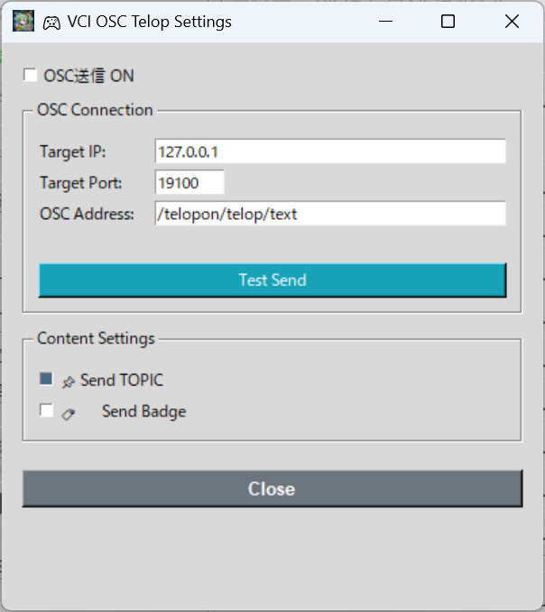

# VCI OSC Telop (VciOscPlugin.py)

**[Download VciOscPlugin.py](https://raw.githubusercontent.com/miyumiyu/TeloPon-Extensions/main/plugins/VciOscPlugin.py)**

This plugin sends AI-generated telops in real time to **VirtualCast VCI** via the **OSC (OpenSound Control)** protocol.
It allows you to display telops within VirtualCast's virtual space.

---

## Prerequisites

### Requirements

1. **VirtualCast** (PC version) is installed and running
2. **OSC receiving** is enabled in VirtualCast settings (port: 19100)
3. A **VCI** for displaying telops is placed in VirtualCast

### VirtualCast OSC Settings

1. From the VirtualCast title screen, open the **"VCI"** settings
2. Set **"OSC Receive Function"** to **"Enabled"** or **"Creator Only"**
3. Confirm that the receive port is **19100** (default)

### VCI Receive Script (Lua)

Set up a Lua script like the following in the telop display VCI:

```lua
-- Receive telops from TeloPon and display them
vci.osc.RegisterMethod("/telopon/telop/text", function(sender, name, args)
    local text = args[1]
    vci.assets.SetText("TextBoard", text)
end, {ExportOscType.String})

-- To receive badges (emotion tags)
vci.osc.RegisterMethod("/telopon/telop/text/badge", function(sender, name, args)
    local badge = args[1]
    -- Effects based on badge, etc.
end, {ExportOscType.String})

-- To receive window type
vci.osc.RegisterMethod("/telopon/telop/text/window", function(sender, name, args)
    local window = args[1]
    -- Switch display based on window type, etc.
end, {ExportOscType.String})
```

> The default OSC address is `/telopon/telop/text`. Make sure it matches the TeloPon settings.

---

## TeloPon Settings and Usage

### 1. Open the Control Panel

On TeloPon's main screen, in the "Extensions (Plugins)" panel on the right side, click the **"Control Panel"** button for **"VCI OSC Telop"**.



### 2. Enable OSC Sending

Check the **"OSC Send ON"** checkbox. This will automatically send an OSC message to VCI every time a telop is displayed.

### 3. Connection Settings

| Setting | Default | Description |
|---|---|---|
| **Destination IP** | `127.0.0.1` | IP address of the PC running VirtualCast (leave as-is if on the same PC) |
| **Destination Port** | `19100` | VirtualCast's OSC receive port |
| **OSC Address** | `/telopon/telop/text` | Must match the `RegisterMethod` on the VCI side |

### 4. Test Send

Press the **"Test Send"** button to send a test message. If text appears on the VCI side, the connection is successful.

### 5. Send Content Settings

| Setting | Default | Description |
|---|---|---|
| **Send TOPIC too** | ON | When ON, sends in the format "TOPIC \| MAIN". When OFF, sends MAIN only |
| **Send badge too** | OFF | When ON, sends the badge (emotion tag) separately to `/address/badge` |

### 6. Close

Click the **"Close"** button or the **X** button to close the settings panel. Settings are automatically saved to `plugins/vci_osc.json`.

---

## OSC Messages Sent

| OSC Address | Data Type | Content | Example |
|---|---|---|---|
| `/telopon/telop/text` | String | Telop body text (may include TOPIC) | `Stream Start \| Welcome everyone!` |
| `/telopon/telop/text/badge` | String | Badge name (optional) | `surprised` |
| `/telopon/telop/text/window` | String | Window type (always sent) | `window-simple` |

> HTML tags in telop text (`<b1>`, `<b2>`, mahjong tile tags, etc.) are automatically stripped and sent as plain text.

---

## Troubleshooting

### Q. "Send failed" appears when testing

- Check that the destination IP and port are correct
- Check that your firewall is not blocking UDP port 19100

### Q. Text does not appear on the VCI side

- Check that VirtualCast's OSC receive function is enabled
- Check that the OSC address in the VCI Lua script matches the TeloPon settings
- Check that the VCI is placed in VirtualCast

### Q. I want to send to VirtualCast on a different PC

- Change the destination IP to the IP address of the PC running VirtualCast
- Allow port 19100 (UDP) in the receiving PC's firewall

---

## Technical Specifications

| Item | Value |
|---|---|
| Protocol | OSC over UDP |
| Library | python-osc (pythonosc) |
| Max message size | Approximately 4000 bytes (VCI-side limitation) |
| Compatibility | VirtualCast PC version only |

---
