# YouTube OAuth連携 - Google Cloud Console 設定ガイド

YouTube OAuth連携プラグインを使うために必要な、Google Cloud Console での設定手順を画像付きで詳しく説明します。

> 所要時間: 約10〜15分

---

## Step 1: Google Cloud Console にログイン

[Google Cloud Console](https://console.cloud.google.com/) にアクセスし、Googleアカウントでログインします。  
初めての場合は利用規約に同意します。

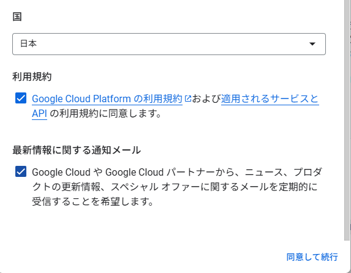

利用規約にチェックを入れて「同意して続行」をクリックします。

> ⚠️ **もし以下の画面が表示された場合:** Googleアカウントの2段階認証プロセス（MFA）が未設定です。  
> 「設定に移動」から有効にしてください。有効化後、60秒ほどでアクセスできるようになります。
>
> 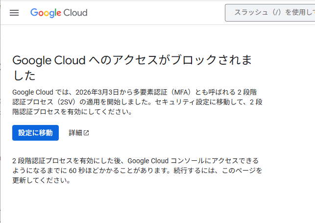

---

## Step 2: 新しいプロジェクトを作成

画面上部の「プロジェクトを選択」をクリックします。

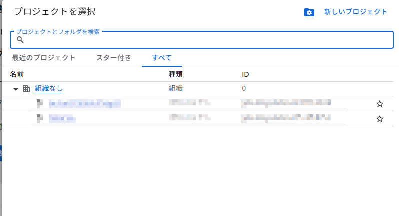

右上の「新しいプロジェクト」をクリックします。

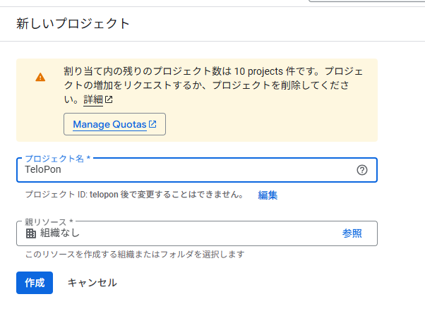

プロジェクト名に `TeloPon`（任意の名前）を入力して「作成」をクリックします。

---

## Step 3: OAuth同意画面の設定

まず、画面左上のプロジェクト名が **TeloPon**（Step 2で作成したプロジェクト）になっていることを確認してください。  
異なる場合は、プロジェクト名をクリックして切り替えてください。

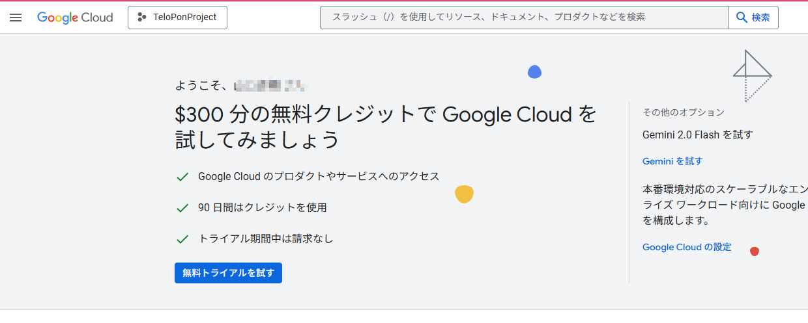

左上の三本線（≡）をクリックしてメニューを開き、「APIとサービス」→「OAuth同意画面」を選択します。

「Google Auth Platform はまだ構成されていません」と表示されるので「開始」をクリックします。

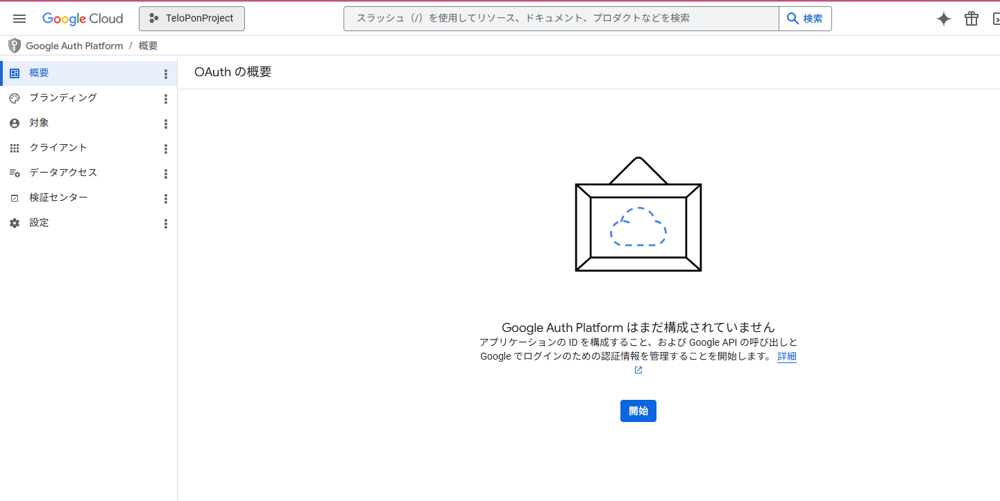

### 3-1: アプリ情報

アプリ名に `TeloPon` と入力し、サポート用のメールアドレスを選択して「次へ」をクリックします。

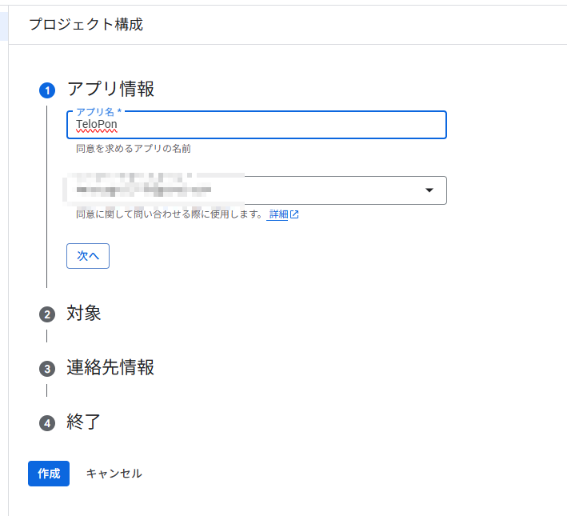

### 3-2: 対象

**「外部」** を選択して「次へ」をクリックします。

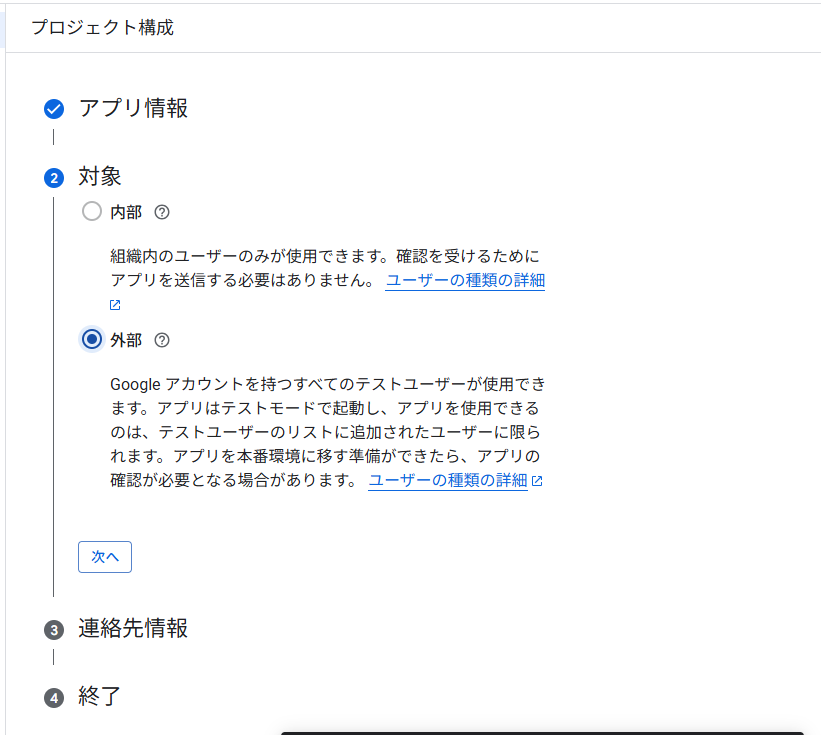

> 「内部」は Google Workspace（企業・学校）アカウント専用です。個人のGoogleアカウントでは「外部」を選んでください。

### 3-3: 連絡先情報

メールアドレスが表示されていることを確認して「次へ」をクリックします。

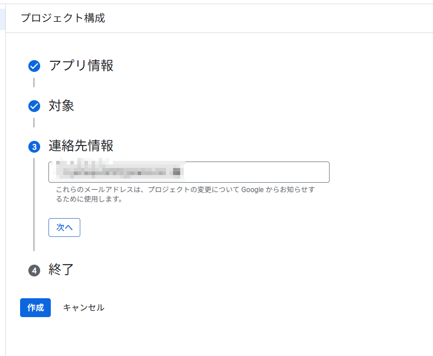

### 3-4: 終了

「Google API サービス: ユーザーデータに関するポリシーに同意します」にチェックを入れて「続行」をクリックします。

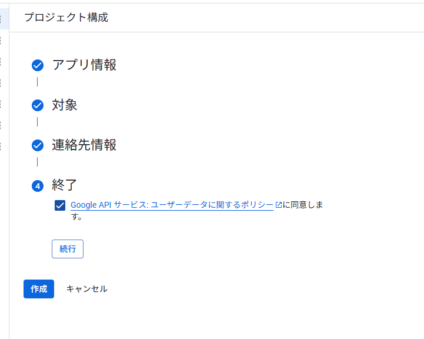

すべてのステップにチェックマークが付いたら「作成」をクリックします。

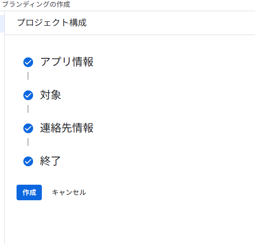

---

## Step 4: YouTube Data API v3 を有効にする

画面上部の検索バーで `YouTube Data API v3` と検索します。

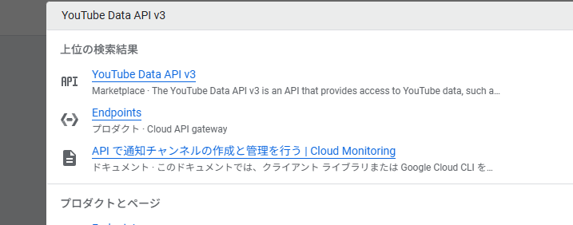

検索結果から「YouTube Data API v3」をクリックし、「有効にする」ボタンを押します。

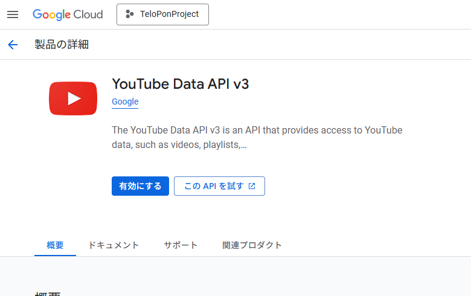

---

## Step 5: スコープの設定

左メニューの「データアクセス」をクリックします。

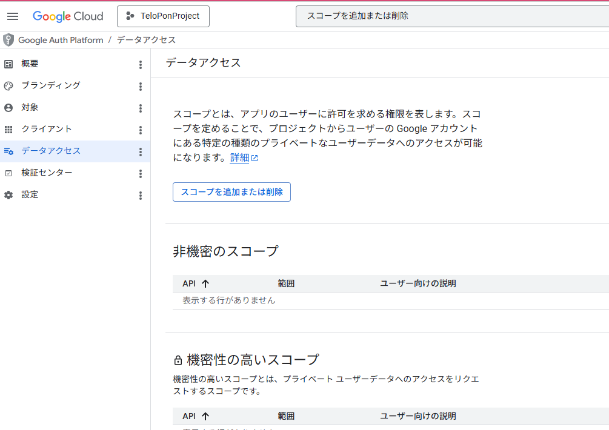

「スコープを追加または削除」をクリックし、フィルタに `youtube.force-ssl` と入力して検索します。

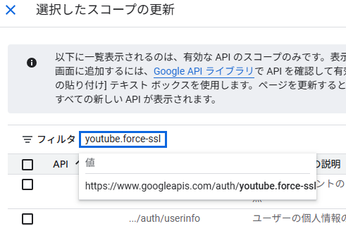

`https://www.googleapis.com/auth/youtube.force-ssl` にチェックを入れて「更新」をクリックします。

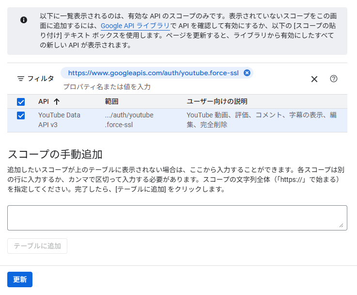

---

## Step 6: テストユーザーの追加

左メニューの「対象」をクリックし、画面下部の「テストユーザー」セクションで「+ Add users」をクリックします。

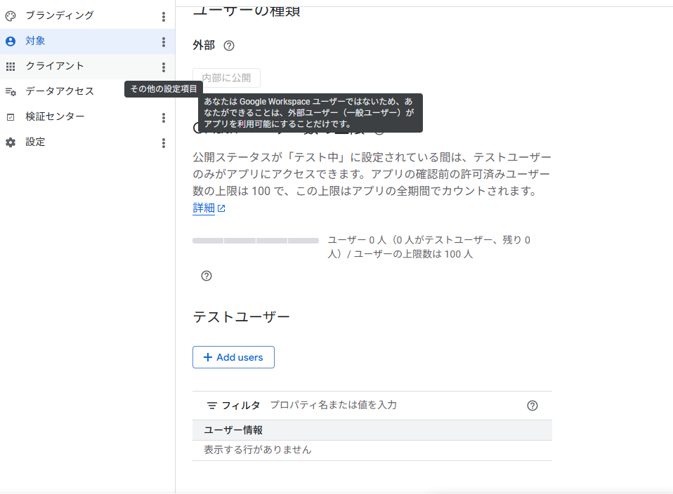

**TeloPonで認証に使うGoogleアカウントのメールアドレス** を入力して「保存」をクリックします。

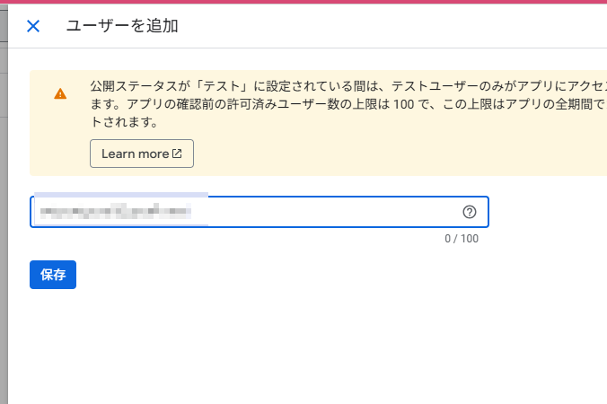

> **重要:** ここに追加したメールアドレスのアカウントだけが認証できます。  
> 自分以外にもTeloPonを使う人がいれば、その人のメールアドレスも追加してください（最大100人）。

---

## Step 7: OAuthクライアントIDの作成

左メニューの「APIとサービス」→「認証情報」をクリックします。  
上部にある「＋認証情報を作成」ボタンから **「OAuthクライアントID」** を選択します。

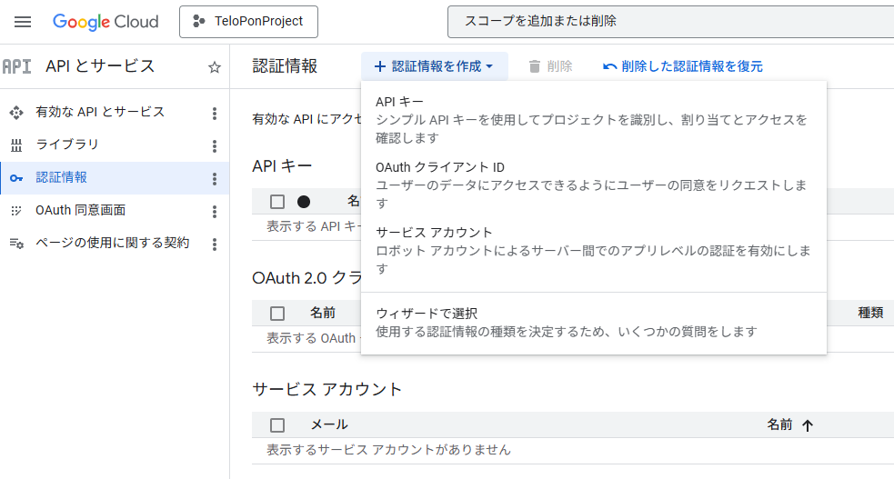

以下の内容を入力します。

| 項目 | 入力内容 |
|---|---|
| アプリケーションの種類 | **デスクトップ アプリ** |
| 名前 | `TeloPon`（任意） |

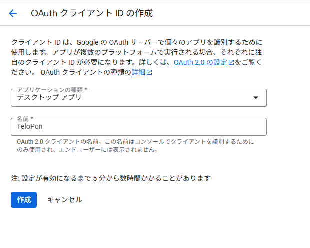

「作成」をクリックすると、**Client ID** と **Client Secret** が表示されます。  
この2つをコピーしてください。

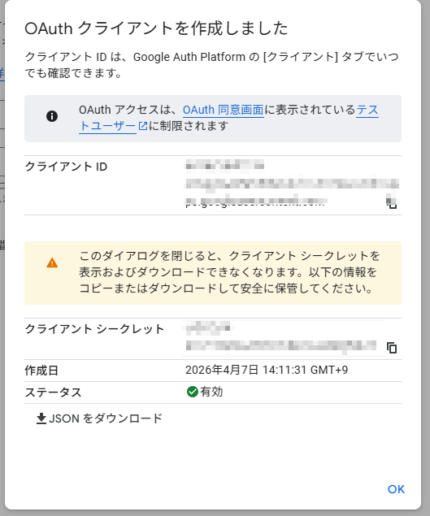

> ⚠️ このダイアログを閉じるとClient Secretは再表示できません。必ずコピーまたはJSONをダウンロードしてください。

---

## Step 8: TeloPonに入力して認証する

TeloPonのプラグイン設定画面を開き、**Client ID** と **Client Secret** を貼り付けて「Googleで認証する」をクリックします。

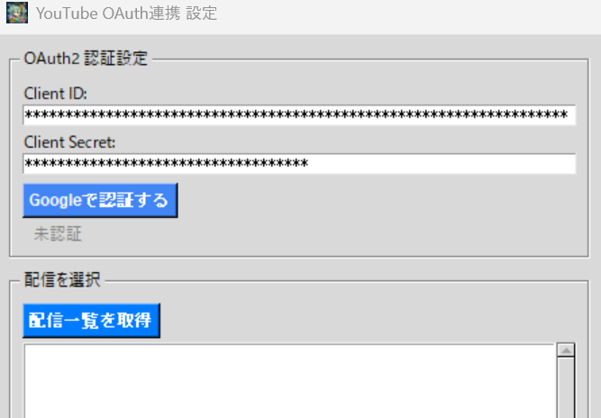

ブラウザが開き、Googleアカウントの選択画面が表示されます。  
TeloPonで使用するアカウント（Step 6でテストユーザーに追加したアカウント）を選択します。

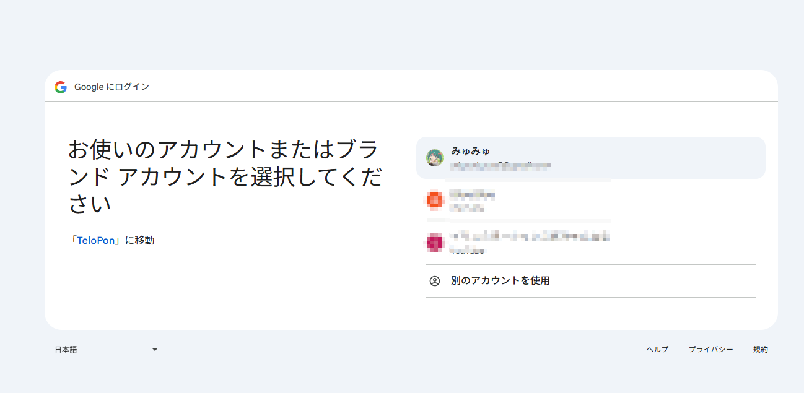

> 他のチャンネルの管理者権限で接続する場合は、管理対象のBrand Accountを選択してください。

「このアプリはGoogleで確認されていません」と表示されますが、自分で作成したアプリなので問題ありません。  
**「続行」** をクリックします。

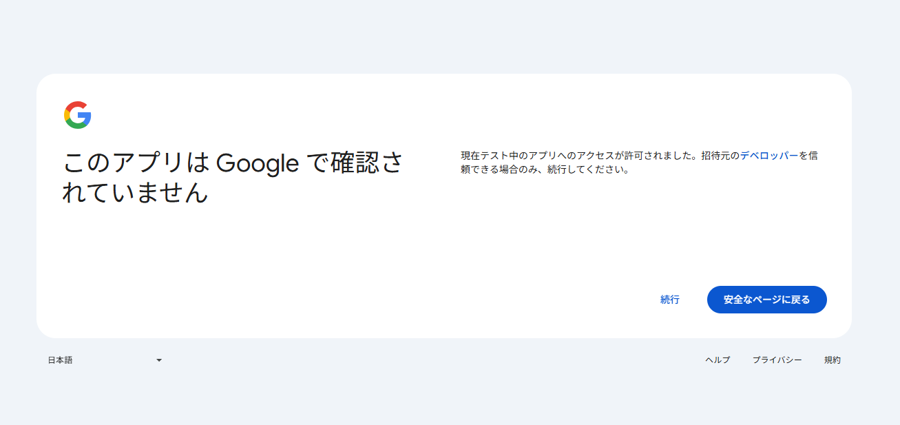

アクセス権限の確認画面が表示されます。「続行」をクリックして許可します。

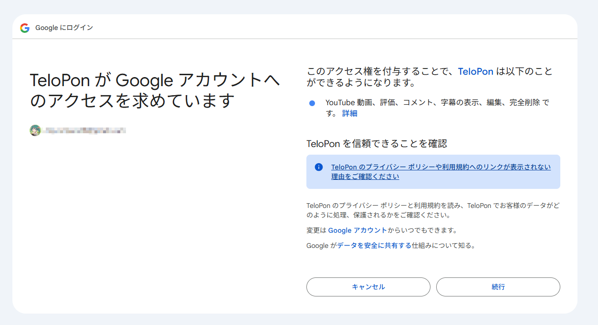

認証が成功すると、TeloPonの設定画面にチャンネル名とサムネイルが表示されます。

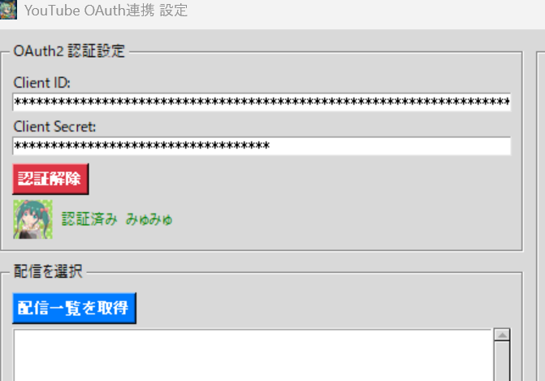

---

## 完了！

これでGoogle Cloud Consoleの設定は完了です。  
以降はTeloPonの設定画面から配信を選択して接続するだけで使えます。

👉 [YouTube OAuth連携プラグインの使い方に戻る](YoutubeLiveOAuth.md)
