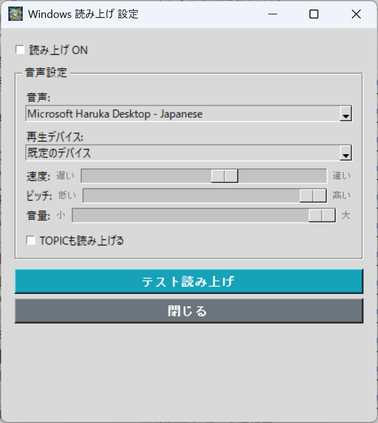

# 🔊 Windows 음성 읽기 플러그인 (WindowsTTS.py)

📥 **[WindowsTTS.py 다운로드](https://raw.githubusercontent.com/miyumiyu/TeloPon-Extensions/main/plugins/WindowsTTS.py)**

Windows 표준 음성 합성 엔진(SAPI5)을 사용하여, AI가 출력한 자막 텍스트를 자동으로 읽어주는 플러그인입니다.  
별도의 외부 소프트웨어 없이 Windows에 기본 탑재된 음성을 그대로 사용할 수 있습니다.

---

## 🌟 주요 기능

| 기능 | 설명 |
|---|---|
| 자막 자동 읽기 | AI가 출력한 MAIN 텍스트를 자동으로 음성화 |
| 음성 선택 | Windows에 설치된 음성 중에서 선택 (한국어/영어 등) |
| 재생 장치 선택 | 출력 장치를 지정 가능 (VB-CABLE 등 가상 장치도 지원) |
| 속도 조절 | 읽기 속도를 슬라이더로 조절 |
| 피치 조절 | 목소리 높낮이를 슬라이더로 조절 |
| 음량 조절 | 읽기 음량을 슬라이더로 조절 |
| TOPIC 읽기 | 자막의 제목(TOPIC)도 읽을지 여부를 전환 |
| 이모지 제거 | 유니코드 이모지 및 `:emoji:` 형식의 텍스트를 자동으로 읽기에서 제외 |

---

## ⚙️ 설정 방법

### 1. 설정 화면 열기

TeloPon의 메인 화면 오른쪽, 「확장 기능」 패널에 있는 **「Windows 음성 읽기」**의 **「⚙️ 설정」** 버튼을 클릭합니다.

### 2. 각 항목 설정하기

| 항목 | 설명 |
|---|---|
| **읽기 ON** | 체크를 넣으면 읽기가 활성화됩니다 |
| **음성** | 읽기에 사용할 음성을 선택합니다. 한국어의 경우 「Microsoft Heami Desktop - Korean」 등이 사용됩니다 |
| **재생 장치** | 음성 출력 장치를 선택합니다. 「기본 장치」는 Windows에서 설정된 기본 출력입니다 |
| **속도** | 읽기 속도를 조절합니다 (100=느리게~350=빠르게, 기본값 200) |
| **피치** | 목소리 높낮이를 조절합니다 (-10=낮게~+10=높게, 기본값 0) |
| **음량** | 읽기 음량을 조절합니다 (0~100, 기본값 100) |
| **TOPIC도 읽기** | 체크를 넣으면 자막의 제목(TOPIC)도 읽어줍니다 |

### 3. 테스트 읽기

「테스트 읽기」 버튼을 누르면 설정한 내용으로 테스트 음성이 재생됩니다.  
문제없으면 「닫기」로 설정을 저장합니다.

---

## 🎧 OBS에 음성을 가져오는 방법

OBS 방송에 AI의 읽기 음성을 실으려면 가상 오디오 장치를 사용합니다.

### 절차

1. **VB-CABLE** 등의 가상 오디오 장치를 설치
2. WindowsTTS 플러그인의 「재생 장치」에서 가상 장치 (예: `CABLE Input`)를 선택
3. OBS에서 「오디오 입력 캡처」를 추가하고, 가상 장치 (예: `CABLE Output`)를 선택

이렇게 하면 AI의 읽기 음성이 OBS에 가져와져서 방송에 실립니다.

---

## 📝 이모지 제거에 대하여

자막에 포함된 이모지는 읽기에서 자동으로 제외됩니다.

| 종류 | 예 | 동작 |
|---|---|---|
| 유니코드 이모지 | 🎮 🔥 💬 | 제거 (읽지 않음) |
| 텍스트 이모지 | `:fire:` `:thumbsup:` | 제거 (읽지 않음) |
| 일반 텍스트 | 안녕하세요 | 그대로 읽기 |

---

## ⚠️ 이용 시 주의사항

- **라이브 중에도 설정 변경 가능:** 이 플러그인은 TOOL 타입이므로, 방송 중에도 속도/음성/장치 등을 실시간으로 변경할 수 있습니다.
- **Windows 전용:** SAPI5는 Windows 전용 음성 합성 엔진입니다. macOS/Linux에서는 동작하지 않습니다.
- **음성 추가:** Windows의 「설정」→「시간 및 언어」→「음성 인식」에서 추가 음성 팩을 설치할 수 있습니다.

---

[⬅️ 확장 플러그인 목록으로 돌아가기](../../README.md)
